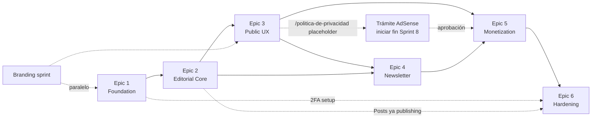

# El Mate Digital — Sprint Plan & Stories Overview

> **Documento:** Sprint Plan v1.0
> **Autor:** River (SM Agent) — AIOS
> **Fecha:** 2026-05-24
> **Estado:** ✅ Refinado y listo para @dev
> **Insumos:** PRD v1.0 + Architecture v1.0 + Brief v1.2

---

## 1. Filosofía de refinamiento

**Refinamiento just-in-time, no upfront.** Solo Epic 1 está totalmente expandido en archivos individuales por story (9 archivos). Epic 2-6 están **sized + secuenciados** acá en este README pero su expansión formal por story se hace al inicio de cada sprint, cuando ya se aprende del sprint anterior.

**Por qué:** refinar 48 stories antes de escribir una sola línea de código es waterfall disfrazado de agile. Las decisiones técnicas que el dev tome en Epic 1 (estructura final de carpetas, primeras decisiones de Payload, etc.) modificarán cómo escribimos las stories de Epic 2 — refinar todo upfront es perder tiempo.

---

## 2. Story Points — Convención

Escala Fibonacci para complejidad relativa (no horas):

| Pts | Significado | Tiempo real estimado (dev focused) |
|---|---|---|
| 1 | Trivial | 5-15 min |
| 2 | Simple | 15-45 min |
| 3 | Estándar | 1-3h |
| 5 | Complejo | 3-6h |
| 8 | Pesado — candidato a sub-split | 6-12h |
| 13 | Demasiado grande — **debe** dividirse | >12h |

**Sprint velocity asumida:** ~12-15 pts/sprint para 1 dev part-time en sprints de 2 semanas. Ajustable tras Sprint 1.

---

## 3. Sub-split decisions

Aplicando los flags del PRD + Architecture:

| Story original | Decisión | Sub-stories | Razón |
|---|---|---|---|
| **2.4 — Posts collection** | ✂️ Split | 2.4a Schema + status, 2.4b Admin UI tabs + SEO | Flagueada en PRD como pesada (>5h proyectado) |
| **5.6 — Premium infra** | ✂️ Split | 5.6a Plans + Stripe SDK, 5.6b Members + Subscriptions + flag | 3 collections + SDK + flag son >5h en una sola |
| 1.6 — 2FA TOTP | ⏸️ Hold split | (single) | Mantener única; si supera 4h en ejecución → split runtime |
| 2.5 — Lexical editor | ⏸️ Hold split | (single, 8 pts) | Mantener única pero sized 8 pts para visibilidad |
| 5.2 — AdSense slots | ⏸️ Hold split | (single) | Mantener única; split runtime si in-article cada N párrafos resulta complejo |

**Total stories tras split:** 48 originales + 2 splits = **50 stories**.

---

## 4. Sprint Plan (15 sprints — ~30 semanas part-time)

> _2-week sprints. Velocity tentativa ~12-15 pts/sprint. La velocidad real se calibra tras Sprint 1-2._

### Sprint 1 — Foundation: Stack base (17 pts) 🟡

| Story | Title | Pts | Notas |
|---|---|---|---|
| 1.1 | Scaffold Next.js + TS + Tailwind + shadcn/ui | 3 | |
| 1.2 | Install Payload CMS 3.0 (incluye spike R7) | 5 | **Riesgo:** Payload 3 + Next 15 + RSC reciente |
| 1.3 | Provision Neon + connect Payload | 3 | |
| 1.4 | CI pipeline (GitHub Actions) | 3 | |
| 1.5 | Vercel auto-deploy + preview per PR | 3 | |

**Sprint goal:** Deploy preview funcional con admin Payload accesible (sin auth completa).
**Sprint slightly over (17 pts)** — el spike R7 puede absorber buffer; si excede, mover 1.5 a Sprint 2.

### Sprint 2 — Foundation: 🎉 Primer URL navegable (13 pts) 🟢

| Story | Title | Pts | Notas |
|---|---|---|---|
| 1.6 | Auth admin + 2FA TOTP | 5 | otplib + backup codes + rate-limit |
| 1.7 | Design tokens + dark/light | 3 | |
| 1.8 | Public canary page in production | 2 | **🎉 Primer URL navegable público** |
| 1.9 | Observability baseline (Pino + Sentry + Speed Insights) | 3 | |

**Sprint goal:** El dueño puede compartir URL público + loguearse al admin con 2FA + ver errores en Sentry.

### Sprint 3 — Editorial Core: Data models (15 pts) 🟢

| Story | Title | Pts | Notas |
|---|---|---|---|
| 2.1 | Taxonomy collections (Categories + ContentTypes + Tags) | 3 | + seed |
| 2.2 | Authors collection | 2 | + seed dueño |
| 2.3 | Media library + Cloudinary (incluye spike R1) | 5 | **Riesgo:** Cloudinary plugin Payload 3 compatibilidad |
| 2.4a | Posts schema + status lifecycle | 5 | Split de 2.4 — schema + drafts versioning |

**Sprint goal:** Modelos de datos persistentes + media library funcional.

### Sprint 4 — Editorial Core: Editor & SEO admin (11 pts) 🟢

| Story | Title | Pts | Notas |
|---|---|---|---|
| 2.4b | Posts admin UI tabs + SEO fields | 3 | Split de 2.4 — pestañas + meta SEO |
| 2.5 | Lexical editor con embeds | 8 | YouTube, X, code, callouts |

**Sprint goal:** Editor rico funcional con todos los bloques.

### Sprint 5 — Editorial Core: Render + Lifecycle (13 pts) 🟢

| Story | Title | Pts | Notas |
|---|---|---|---|
| 2.6 | Scheduled-publish cron job | 3 | Vercel Cron */5min |
| 2.7 | Preview drafts con token expirante | 2 | |
| 2.8 | Render público home | 3 | Hero + últimos posts |
| 2.9 | Render público artículo | 5 | TOC y related vienen en Sprint 7 |

**Sprint goal:** 🎉 **Primer artículo publicable y leíble en producción.**

### Sprint 6 — Public UX: Navegación (10 pts) 🟢

| Story | Title | Pts | Notas |
|---|---|---|---|
| 3.1 | Header + footer + nav móvil | 5 | Driven by taxonomy |
| 3.2 | Term listing pages (categoría + tipo + tag) | 3 | Componente reusable |
| 3.3 | Página de autor | 2 | |

**Sprint goal:** Sitio navegable end-to-end.

### Sprint 7 — Public UX: Reading + Search (10 pts) 🟢

| Story | Title | Pts | Notas |
|---|---|---|---|
| 3.4 | Article: TOC + related + share extendido | 5 | |
| 3.5 | Búsqueda con Postgres FTS | 5 | **Riesgo R5:** español + acentos |

**Sprint goal:** Página de artículo completa + descubrimiento por búsqueda.

### Sprint 8 — Public UX: SEO + Static (11 pts) 🟢

| Story | Title | Pts | Notas |
|---|---|---|---|
| 3.6 | SEO meta + OG + Twitter + JSON-LD | 3 | |
| 3.7 | sitemap.xml + robots + canonical | 2 | |
| 3.8 | RSS feeds (global + categoría) | 3 | |
| 3.9 | StaticPages collection + páginas estáticas | 3 | |

**Sprint goal:** Sitio indexable + páginas legales con placeholders. **⚠️ Iniciar trámite AdSense al cerrar este sprint** (sin esto Epic 5 puede bloquearse).

### Sprint 9 — Newsletter: Opt-in (10 pts) 🟢

| Story | Title | Pts | Notas |
|---|---|---|---|
| 4.1 | Subscribers + signup form | 5 | 3 placements + honeypot |
| 4.2 | Resend setup + doble opt-in | 5 | **Riesgo R6:** deliverability sin dominio |

**Sprint goal:** Suscripción funcional con confirmación.

### Sprint 10 — Newsletter: Composer + Send (13 pts) 🟢

| Story | Title | Pts | Notas |
|---|---|---|---|
| 4.3 | Unsubscribe + List-Unsubscribe headers | 3 | |
| 4.4 | Newsletters collection + composer | 5 | Lexical email-safe |
| 4.5 | Send broadcast via Resend | 5 | + bounces webhook |

**Sprint goal:** Envío de la primera edición real.

### Sprint 11 — Newsletter: Archivo + Mgmt (6 pts) 🟡

| Story | Title | Pts | Notas |
|---|---|---|---|
| 4.6 | Public newsletter archive | 3 | |
| 4.7 | Admin list management (filters + export CSV) | 3 | |

**Sprint corto** (6 pts) — usar el buffer para empezar producción del seed editorial (Story 6.5) en paralelo.

### Sprint 12 — Monetization: AdSense (11 pts) 🟢

| Story | Title | Pts | Notas |
|---|---|---|---|
| 5.1 | AdSlots collection + toggle | 3 | + seed |
| 5.2 | AdSense script + slot rendering | 5 | **Riesgo R2:** CSP + AdSense convivencia |
| 5.3 | Cookie consent / CMP (Funding Choices) | 3 | |

**Sprint goal:** AdSense infra lista (esperando aprobación si no llegó).

### Sprint 13 — Monetization: Afiliados + Premium infra (18 pts) 🔴

| Story | Title | Pts | Notas |
|---|---|---|---|
| 5.4 | Afiliados Amazon: shortlinks + tracking | 5 | |
| 5.5 | Disclaimer automático afiliados | 3 | |
| 5.6a | Premium: Plans + Stripe SDK | 3 | Split de 5.6 |
| 5.6b | Premium: Members + Subscriptions + flag | 5 | Split de 5.6 |
| 5.7 | requiresMembership() helper + tests | 2 | |

**Sprint over (18 pts)** — candidato a partir en 13a / 13b si velocity confirma. Alternativa: empujar 5.4-5.5 a Sprint 14.

### Sprint 14 — Hardening Part 1 (13 pts) 🟢

| Story | Title | Pts | Notas |
|---|---|---|---|
| 6.1 | Contenido editorial-real de políticas | 5 | **Bloqueante AdSense aprobación** |
| 6.2 | AuditLogs admin view | 3 | |
| 6.3 | CSP estricta + headers + rate-limit comprehensive | 5 | |

**Sprint goal:** Cumplimiento legal y seguridad lista para soft-launch.

### Sprint 15 — Hardening Part 2 + Soft-Launch (18 pts) 🔴

| Story | Title | Pts | Notas |
|---|---|---|---|
| 6.4 | Admin dashboard con métricas | 3 | |
| 6.5 | Editorial seed (10-15 artículos) | 5 | **No es código** — producción editorial |
| 6.6 | Tuning final perf/a11y/observability + runbook | 5 | |
| 6.7 | Tests E2E flujos críticos | 5 | |

**Sprint over (18 pts)** — partir si velocity lo exige. Story 6.5 puede ejecutarse en paralelo a las otras (es trabajo editorial, no de dev).

**Sprint final goal:** 🎉 **MVP DONE — soft-launch ready.**

---

## 5. Resumen de delivery por epic

| Epic | Stories | Pts | Sprints | Visible al usuario |
|---|---|---|---|---|
| 1 — Foundation | 9 | 30 | Sprints 1-2 | 🎉 Canary page en Sprint 2 |
| 2 — Editorial Core | 10 (post-split) | 39 | Sprints 3-5 | 🎉 Artículo publicable en Sprint 5 |
| 3 — Public UX & SEO | 9 | 31 | Sprints 6-8 | Sitio navegable + indexable |
| 4 — Newsletter | 7 | 29 | Sprints 9-11 | Newsletter envío real |
| 5 — Monetization | 8 (post-split) | 29 | Sprints 12-13 | Ingresos AdSense + afiliados |
| 6 — Hardening | 7 | 31 | Sprints 14-15 | 🎉 **MVP DONE** |
| **TOTAL** | **50** | **189** | **15 sprints** | |

---

## 6. Dependencias cross-épica

### Dependencias críticas

| Bloqueado | Bloquea por | Mitigación |
|---|---|---|
| **Epic 5 (Monetization)** | Aprobación AdSense (3-6 semanas) | Iniciar trámite al cerrar Sprint 8 |
| **Sprint 14 (6.1 políticas)** | Necesarias antes de aplicar AdSense | Adelantar 6.1 a Sprint 8 si quiere acelerar AdSense |
| **Story 1.7 (design tokens)** | Branding sprint cerrado | Si branding no cerró, tokens son placeholders sustituibles |
| **Story 4.5 (newsletter envío real)** | Dominio registrado para deliverability | Registrar dominio antes de Sprint 10 |
| **Story 2.3 (Media + Cloudinary)** | Spike R1 compatibilidad plugin | Hacer spike en Sprint 1 si posible (paralelo a 1.2) |

---

## 7. Risk mitigation assignments por sprint

| Riesgo (de architecture.md §19) | Validar en sprint | Story dueña |
|---|---|---|
| **R1** Cloudinary plugin Payload 3 | Sprint 3 | 2.3 |
| **R2** CSP + AdSense convivencia | Sprint 12 | 5.2 / 5.3 |
| **R3** X/Twitter embeds fragilidad | Sprint 4 | 2.5 |
| **R4** Vercel Cron límite Hobby | Sprint 1 | 1.5 (verificar plan) |
| **R5** Postgres FTS español | Sprint 7 | 3.5 |
| **R6** Resend deliverability sin dominio | Sprint 9-10 | 4.2 / 4.5 |
| **R7** Payload 3 + Next 15 + RSC | Sprint 1 | 1.2 |

---

## 8. Cross-cutting concerns por story

Todas las stories de todos los épicas deben mantener estas concerns transversales:

| Concern | Cuándo se aplica | Validación |
|---|---|---|
| **TypeScript strict** | Cada PR | CI typecheck |
| **Tests escritos en la misma story** | Cada feature | CI test pass |
| **WCAG AA en UI nueva** | UI de público | Manual + axe en Story 6.6 |
| **Performance: no regresar LCP/INP/CLS** | UI de público | Speed Insights tras deploy preview |
| **Logging estructurado en acciones críticas** | Backend / admin | Code review |
| **Audit log en acciones admin críticas** | Admin actions | Code review + Story 6.2 valida |
| **CSP nonce respetado** | Cualquier inline script | Story 6.3 hardenea final |
| **Rate-limit en endpoints públicos nuevos** | API routes | Code review |

---

## 9. Definition of Ready (DoR) — para que una story entre al sprint

- [ ] AC del PRD copiados al story file individual.
- [ ] Dev notes con extracto relevante del architecture (sin obligar al dev a abrir el doc completo).
- [ ] Tasks/subtasks listados.
- [ ] Tests requeridos definidos (file location + framework).
- [ ] Dependencias previas resueltas o flagueadas explícitamente.
- [ ] Story points asignados.
- [ ] Riesgos asociados flagueados (si aplica).

---

## 10. Definition of Done (DoD) — para cerrar una story

- [ ] Todos los AC cumplidos y verificables.
- [ ] Tests unitarios pasan.
- [ ] Tests E2E del flujo asociado (si es flujo crítico) pasan.
- [ ] TypeScript typecheck verde.
- [ ] ESLint sin errores.
- [ ] Preview deploy verde y validado manualmente.
- [ ] Audit log capturando acciones críticas relevantes (si aplica).
- [ ] Logger estructurado en eventos clave (si aplica).
- [ ] Code review por @dev pre-commit (CodeRabbit si está activo).
- [ ] PR mergeable (sin conflictos) — push y merge vía @github-devops.
- [ ] Story file individual actualizada con `Status: Done` + `File List` + `Completion Notes`.

---

## 11. Branch strategy

- **`main`** → producción (Vercel auto-deploy).
- **`feature/X.Y-story-name`** → una branch por story (ej `feature/1.1-scaffold-nextjs`).
- **PRs pequeños**: 1 story = 1 PR (≤500 LoC ideal).
- **CI obligatoria**: lint + typecheck + unit + e2e (en main) antes de merge.
- **No force push a main** ni a branches con PR abierto.
- **Branches locales** las maneja @sm (yo); push y PR los maneja @github-devops.

---

## 12. Workflow operativo recomendado

Para cada story:

1. **@sm crea branch local**: `git checkout -b feature/X.Y-story-name`
2. **@dev implementa** siguiendo la story file individual.
3. **@dev escribe tests** en la misma story.
4. **@dev marca Status: Review** y notifica.
5. **@qa valida** AC y DoD (si está disponible).
6. **@github-devops pushea + crea PR**.
7. **CI corre** (lint + typecheck + test + preview deploy).
8. **CodeRabbit revisa** (si activo).
9. **@github-devops merge** a main (squash merge recomendado).
10. **@dev actualiza Status: Done** en story file + cierra branch local.

---

## 13. Epic 1 — Stories detalladas

Las 9 stories de Epic 1 están expandidas en archivos individuales:

- [`1.1-scaffold-nextjs.md`](./1.1-scaffold-nextjs.md)
- [`1.2-install-payload.md`](./1.2-install-payload.md)
- [`1.3-provision-neon.md`](./1.3-provision-neon.md)
- [`1.4-ci-pipeline.md`](./1.4-ci-pipeline.md)
- [`1.5-vercel-deploy.md`](./1.5-vercel-deploy.md)
- [`1.6-admin-auth-2fa.md`](./1.6-admin-auth-2fa.md)
- [`1.7-design-tokens-theme.md`](./1.7-design-tokens-theme.md)
- [`1.8-canary-page.md`](./1.8-canary-page.md)
- [`1.9-observability-baseline.md`](./1.9-observability-baseline.md)

---

## 14. Epic 2-6 — Refinamiento just-in-time

Las stories de Epic 2-6 están sized + secuenciadas acá pero se expanden en archivos individuales **al inicio de cada sprint correspondiente**, tras aprender del sprint anterior. Esta es la práctica ágil estándar: refinar 4+ sprints adelante es waterfall disfrazado.

**Cuándo refinar:**
- Sprint actual termina viernes → SM expande las stories del sprint siguiente lunes.
- Si el dev descubre algo en una story que cambia stories futuras → @sm hace `*correct-course`.

---

*— River, removendo obstáculos 🌊*
